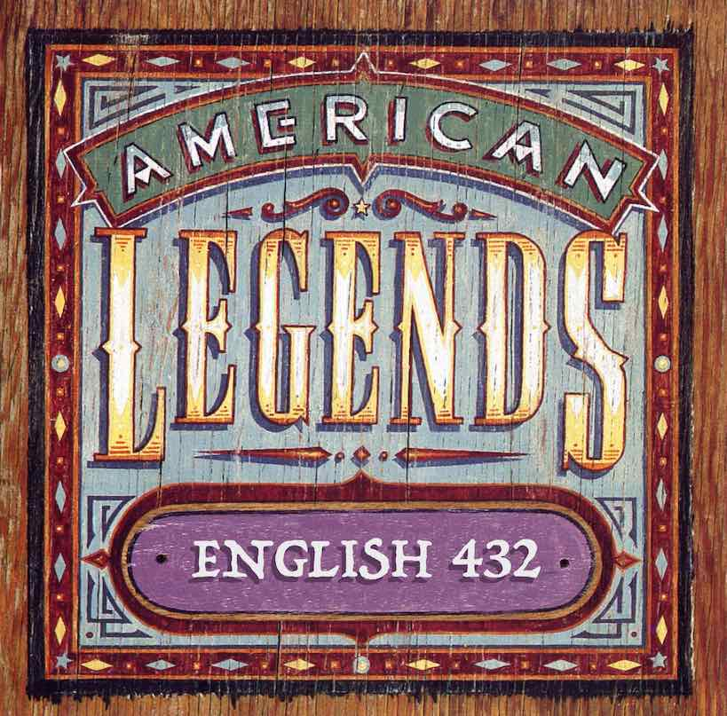

title: 432|Syllabus

<!--   -->

# America in Legend

English 432: American Folklore  
MW 1:00-2:15, HLG 202  
[Course Agenda](agenda.md)

Professor John Laudun  
HLG 356, MW 2:30-3:30, Tuesdays 9:00–12:00, and by appointment. 482-5493 or laudun@louisiana.edu

## Course Description

The course is designed to introduce participants to the basics of folklore studies, both through an initial "bootcamp" as well as through ongoing readings -- some as a focus for conversation, others as sidebars, and then to explore the way that America is socially constructed through stories we tell, sometimes to cheer ourselves on, and sometimes to scare ourselves silly. As an advanced course for undergraduates and a foundational course for graduate students, this course attempts to address folk materials and dynamics in terms of rhetorical effectiveness, literary/generic structure, and cultural history. Some students will be interested in the theory that will be used, albeit lightly, throughout the course, and non-folklorists interested in American literature and culture will find the historical dimensions critical to understanding certain genres/topics of American fiction.

The goal of this course is to examine online, and offline, legends and understand the sources, both structural and referential, upon which they draw. Social media will be one of our foci, and as such this course highlights that media, first, has always been social, and that, second, the social world has always been mediated. Because of the personal nature of much of social media, participants in this course will need to have an open mind about the nature of meaning, and, just as importantly, about the varieties of human experience and perception. Much of the material in this course reveals the anxieties and fears, the prejudices and blindnesses, that humans too often carry with them and rarely communicate directly, only allowing them to slip out indirectly, in stories and assertions that manifest what are often tangled knots of things thought and/or felt. In some cases, the knots are not pretty.

## Course Requirements

For matters of daily comportment and responsibility, please see [The Essentials](../guides/essentials.md).

###  Texts

A great deal of the readings are scholarly in nature and will be available either as links to JSTOR and Project Muse or through the course’s Moodle site, either as PDFs or as links to sites. In addition to the on-line materials, there are a few books required for this course. Those titles will be given to you within the first few weeks of classes. Expect to purchase between 2 and 4 books, so be sure to set aside a portion of your budget for that expense, in addition to the cost of printing other materials as needed.

### Assignments

The assignment schedule for this course is simple: participation, exams, and a course project. Participation is worth 20% of your grade. Each of the exams is worth 15%; and the course project is worth the remaining 50%.

* **Participation** can be a source of confusion. Does it mean just showing up? Showing up is understood: an advanced course depends upon all of us being in the room (on time) and being prepared to discuss the topic at hand. A 400-level course in the humanities is not a data dump, but an opportunity to absorb new material, digest it, use it to analyze old and new points of information, and create new forms of knowledge that may be interesting or valuable to no one else but yourself. Active engagement with the materials, the topics, and others is requisite to achieve full marks in participation.
* The course **project** requires independent enterprise on the part of course participants, who are free to choose from a wide variety of topics, so long as they can make a case to me both in the intial proposal and in the paper itself that it fits within the scope of the course. The wide possible scope is on purpose, but negotiating the parameters of the project with the instructor is *required*. In order to encourage participants to take full advantage of the course's lengthy drafting process, half of the project’s final grade, or 25% of the overall grade, is based on completion of the drafting process, which in many instances is no more than turning in the required items on time. Full credit, full stop. (Looking for a project? There's always [50 Hottest Urban Legends on Snopes](https://www.snopes.com/50-hottest-urban-legends/).) Please note that this is an advanced undergraduate, foundational graduate course in the humanities: our focus is on texts. Please make sure that any work you turn in for evaluation is similarly focused.
* The **exams** are what they are, though they are sometimes replaced with take-home writing assignments to be completed by a specified deadline. 

## Resources

A lot of collections of "American folklore" have been published over the years, each with its own assumptions about both "America" and "folklore" as well as what the purpose of such a collection should be. Typical of one kind of collection are those by Charles Skinner, whose _Myths and Legends of Our Own Land_ reaches 9 volumes. A more synthetic, and more contemporary, reference can be found in the _American Folklore: An Encyclopedia_, edited by Jan Brunvand, a copy of which is available in the university library (Reference GR101.A54). While dated by contemporary scholarly perspectives, the collection of essays in Don Yoder’s _American Folklife_ (GR105.A6) is still quite useful, and foundational in many ways.

In addition to reference works focused on the topic of American folklore, there are a myriad of other specialist reference works, many of which are available either in electronic formats or in the library for your use. Consider the following titles: _The Greenwood Encyclopedia of African American Folklore_, _Encyclopedia of Asian American Folklore and Folklife_, the _Encyclopedia of Life Writing_, _The Greenwood Encyclopedia of World Folklore and Folklife_ are all the kinds of entry texts, being encyclopedias that will be familiar to your freshman/sophomore self but will also get your junior/senior/graduate self on the road to more serious and substantial work. That is, in addition to a synthesis/summary of a topic from a particular perspective, most scholarly encyclopedias also offer a small number of suggested readings. Please follow through on those readings the way you would a link on a web page.

## Institutional Necessities

One day, the University will create a central resource that collects stuff like this, but until then, they ask faculty to include things like this:

### Emergency Evacuation Procedures

A map of this floor is posted near the elevator marking the evacuation route and "Designated Rescue Area." Students who need assistance should identify themselves to the instructor.

### Accessibility Services, Disability Services, & Other Helpful People

The university maintains a wide variety of services and centers designed to help students who have either ongoing or emergent needs. Please don’t hesitate to contact any of these folks, [http://louisiana.edu/academics/academic-support-services](http://louisiana.edu/academics/academic-support-services), and don’t be embarrassed to talk to me.

## Course Schedule

Please note that this course does not follow a fixed, calendrical schedule, but, rather, an [agenda](agenda.md). If you miss class, reach out to one of your contacts to ascertain where we are in the agenda.
